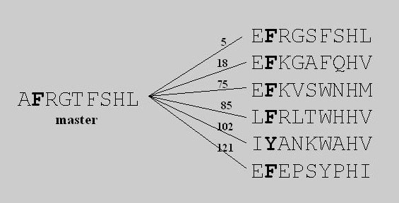
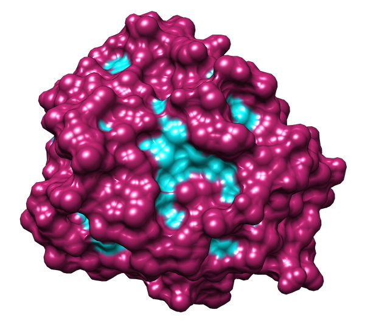

<hr>

Table of Contents
=================

  * [WHat Information does Surface Conservation Yield?](#what-information-does-surface-conservation-yield)
  * [How does WHISCY work?](#how-does-whiscy-work)
  * [1. Installation](#1-installation)
  * [2. WHISCY setup](#2-whiscy-setup)
  * [3. WHISCY prediction](#3-whiscy-prediction)

## WHat Information does Surface Conservation Yield?

WHISCY is a program to predict protein-protein interfaces. It is primarily based on conservation, but it also takes into account structural information. A sequence alignment is used to calculate a prediction score for each surface residue of your protein.

This repository contains the Python 3 implementation of the original code developed by [Sjoerd de Vries](https://scholar.google.de/citations?user=fpjNl3wAAAAJ&hl=en) and originally published in [2006](https://doi.org/doi:10.1002/prot.20842):

> *De Vries SJ, van Dijk ADJ, and Bonvin AMJJ*<br>
> WHISCY: What information does surface conservation yield? Application to data-driven docking.<br>
> *Proteins: Struc. Funct. & Bioinformatics*; 2006, **63**(3): 479-489.


## How does WHISCY work?

WHISCY requires a protein structure and a sequence alignment. First, it identifies a master sequence, the sequence that best matches the structure.

The sequence distance (amount of mutation) between the master sequence and all sequences is estimated. This determines the amount of expected mutation.

Then, for each residue, the expected mutation is compared with the observed mutation. Less change than expected means conservation, translated into a positive WHISCY score.

<div style="text-align:center;">
    
</div>

Next, the interface propensity is taken into account.

Phenylalanines, for example, are likely to be in a protein-protein interface, so all phenylalanines receive a higher score. Lysines are much less likely to be in a protein-protein interface, so lysines receive a lower score.

Finally, all scores are smoothed over the surface of the protein structure.

Interfaces often form patches, so that neighbours of interface residues often are interface residues, too. The smoothing means that the scores of these neighbours are taken into account.

<div style="text-align:center;">
    
</div>


## 1. Installation

WHISCY needs the following software to be installed:

* **Python 3** (tested in version 3.6.6)
* **Python 3 libraries**: numpy (1.15.0), nose (1.3.7), biopython (1.71)
* **GNU CC compiler** (gcc, tested on version 6.4.0)
* **FreeSASA** (tested on version 2.0.3)
* **MUSCLE** (only if you want WHISCY to do automotically the multiple sequence alignment for you, tested on version 3.8.31)

Software version is indicative except for Python, which has to be from the 3.6.x series, and freesasa from the series 2.x and above.

### 1.1. Installation in macOS

#### 1.1.1. Python3, GCC and libraries
Using [Macports](https://www.macports.org/), you can install Python 3 and the necessary libraries, GCC and git:

```bash
sudo port install gcc6 git python36 py36-biopython py36-numpy py36-nose
```

Similar installation should be possible using [Homebrew](https://brew.sh/) instead of Macports.

If you already have `python3` and `pip3` installed, it is completely OK to install `bio`, `numpy`and `nose` libraries using `pip3`.


#### 1.1.2. MUSCLE
To install MUSCLE, go to [the official download site](https://www.drive5.com/muscle/downloads.htm), download the Mac OS X version suitable for your architecture (32 or 64bit) and follow the instructions provided by the authors.

#### 1.1.3. FreeSASA
Go to the [FreeSASA main site](https://freesasa.github.io/) and follow the `Quick-start guide`. We don't need the Python bindings as we will be calling freesasa binary from command line.

**Make sure freesasa binary is in your path:**

```bash
$ freesasa --version
FreeSASA 2.0.3
License: MIT <http://opensource.org/licenses/MIT>
If you use this program for research, please cite:
  Simon Mitternacht (2016) FreeSASA: An open source C
  library for solvent accessible surface area calculations.
  F1000Research 5:189.

Report bugs to <https://github.com/mittinatten/freesasa/issues>
Home page: <http://freesasa.github.io>
```

#### 1.1.4. WHISCY
Then, the next step is to clone thise repository:

```bash
git clone https://github.com/haddocking/whiscy.git
cd whiscy
pwd
```

With `pwd`, you will get the directory where you have cloned `whiscy`. Please, copy that directory path because you will need to specify it in your `.bashrc` or `.bash_profile` file.

Edit your `.bashrc` or `.bash_profile` and add the following lines:

```bash
# Whiscy
export WHISCY_PATH=/PATH/TO/WHISCY
export PYTHONPATH=$PYTHONPATH:${WHISCY_PATH}
export WHISCY_BIN=${WHISCY_PATH}/whiscy.py
export PATH=$PATH:${WHISCY_PATH}
```

You have to change `/PATH/TO/WHISCY` according to the directory pointed by the `pwd` command.

Now, we compile the `protdist` software: 

```bash
cd $WHISCY_PATH
cd bin/protdist
./compile.sh
./protdist 
```

If we see an output like this:

```
Too few arguments for this modified version of PROTDIST
Usage: protdist <infile> <outfile>
```
everything is ready.

There is only one final step where we tell WHISCY about where to find MUSCLE binary. Edit `$WHISCY_PATH/etc/local.json`:

```json
{
  "ALIGN": {
    "MUSCLE_BIN": "/path/to/bin/muscle/muscle3.8.31_i86darwin64"
  },
  "CUTOFF": {
    "sa_pred_cutoff": 15.0,
    "sa_act_cutoff": 40.0,
    "air_cutoff": 0.18,
    "air_dist_cutoff": 6.5
  },
  "AIR": {
    "air_pro_percentage": 10.0,
    "air_wm_pro_or": 98.52,
    "air_wm_whis_or": 0.370515,
    "air_wm_pro_and": 55.42,
    "air_wm_whis_and": 0.106667
  }
}
```

Change the `MUSCLE_BIN` variable to the correct path of your MUSCLE binary.


### 1.2. Installation in GNU/Linux

In Debian/Ubuntu flavours use `apt`:

```bash
sudo apt-get install python3 python3-numpy python3-nose2 python3-biopython gcc-4.6 git-all
```

For the next steps, see the macOS instructions which also apply: [1.1.2](#112-muscle), [1.1.3](#113-freesasa) and [1.1.4](#114-whiscy).


## 2. WHISCY setup

WHISCY needs of some initial data in order to do the prediction. For that purpose, a script called `whiscy_setup.py` is provided:

```bash
$ whiscy_setup.py 
usage: whiscy_setup [-h] pdb_file_name chain_id
whiscy_setup: error: the following arguments are required: pdb_file_name, chain_id
```

The parameters of this script are `pdb_file_name` and `chain_id`. While `pdb_file_name` can be a pdb file (for example `1ppe.pdb`) or a [PDB code](https://www.rcsb.org/) (`1ppe`), `chain_id` is a character (upper or minor case) indicating the chain of the molecule to use for the prediction.

For example, if we are instered in predicting the chain E of the 1PPE complex:

```bash
$ whiscy_setup.py 1ppe e
Downloading PDB structure '1ppe'...
whiscy_setup [INFO] PDB structure with chain E saved to 1ppe_E.pdb
whiscy_setup [INFO] Atom accessibility calculated to 1ppe_E.rsa
whiscy_setup [INFO] Surface and buried residues calculated
whiscy_setup [INFO] Downloading HSSP alignment...
whiscy_setup [INFO] HSSP alignment stored to 1ppe.hssp
whiscy_setup [INFO] HSSP file converted to PHYLIP format
whiscy_setup [INFO] Protdist calculated
whiscy_setup [INFO] Conversion table file generated
whiscy_setup [INFO] Whiscy setup finished
```

`whiscy_setup.py` first checks if the PDB file or PDB structure contains the chain indicated, then tries to download from the [HSSP database](https://swift.cmbi.umcn.nl/gv/hssp/) the PDB complex MSA alignment. If this step fails, the script will try a different approach based on 1) [NBCI Blastp](https://blast.ncbi.nlm.nih.gov/Blast.cgi) and then 2) a multiple sequence alignment of the `blastp` results using `MUSCLE`.

Note that `whiscy_setup.py` requires of internet access in order to gather the relevant files.

### whiscy_setup.py output

`whiscy_setup.py` generates a set of files needed for the prediction step with `whiscy.py`. Here it is a list of the generated files in our 1ppe complex [example](example/):

| File name                                 |    Explanation                                                 |
| ----------------------------------------- |----------------------------------------------------------------|
| [1ppe.hssp](example/1ppe.hssp)           | Multiple sequence alignment download from the HSSP database     |
| [1ppe.hssp.bz2](example/1ppe.hssp.bz2)   | HSSP MSA file compressed                                        |
| [1ppe.pdb](example/1ppe.pdb)             | PDB file download from the Protein Data Bank                    |
| [1ppe_E.pdb](example/1ppe_E.pdb)         | 1ppe.pdb parsed to select only the given `chain_id`             |
| [1ppe_E.rsa](example/1ppe_E.rsa)         | SASA output of `freesasa` in `NACCESS` format of `1ppe_E.pdb` file|
| [1ppe_E.fasta](example/1ppe_E.fasta)     | Sequence of 1ppe_E.pdb. Alternative residues have been removed  |
| [1ppe_E.phylseq](example/1ppe_E.phylseq) | MSA file translated from HSSP to PHYLIP format                  |
| [1ppe_E.conv](example/1ppe_E.conv)       | PDB residue numeration to FASTA sequence numeration             | 
| [1ppe_E.out](example/1ppe_E.out)         | Output of the `protdist` software on 1ppe_E.pdb                 | 
| [1ppe_E.sur](example/1ppe_E.sur)         | >15 % surface residue list according to `sa_pred_cutoff` cutoff | 
| [1ppe_E.suract](example/1ppe_E.suract)   | >40 % surface residue list according to `sa_act_cutoff` cutoff  | 
| [1ppe_E.lac](example/1ppe_E.lac)         | 0-15 % accessible residue list                                  | 


## 3. WHISCY prediction

Running the main `whiscy.py` script without parameters will give you a guess of the required files for WHISCY in order to predict the interface residues of your protein:

```bash
$ whiscy.py
usage: whiscy [-h] [-o output_file]
              surface_list conversion_table alignment_file distance_file
whiscy: error: the following arguments are required: surface_list, conversion_table, alignment_file, distance_file
```

WHISCY needs of four input files:

* `surface_list` which is a list of residues in the interface. Tipically comes with `.sur`extension, for example [1ppe_E.sur](example/1ppe_E.sur).
* `conversion_table`, the file representing the mapping of the PDB file residue numeration into the FASTA sequence numeration, tipically with `.conv` extension and for example, [1ppe_E.conv](example/1ppe_E.conv).
* `alignment_file` is the MSA file in PHYLIP format, `.phylseq` extension, [1ppe_E.phylseq](example/1ppe_E.phylseq).
* `distance_file` is the output of protdist software, in our example with extension `.out`: [1ppe_E.out](example/1ppe_E.out).

If we try the input from our example, `whiscy_setup.py` runs with the protein [1PPE](https://www.rcsb.org/structure/1ppe) and chain `E`:

```bash
$ whiscy.py 1ppe_E.sur 1ppe_E.conv 1ppe_E.phylseq 1ppe_E.out 
whiscy [INFO] Parsing surface list...
whiscy [INFO] Loading conversion table...
whiscy [INFO] Converting...
whiscy [INFO] Initializing score calculation...
whiscy [INFO] Calculating scores...
whiscy [INFO] Subtracting average value ...
whiscy [INFO] Sorting scores...
whiscy [INFO] Writing scores...
0.95155   G19 
0.95070  G219 
0.91582  G133 
0.90942   H57 
0.87666   P28 
0.84307   G18 
0.82484  K107 
0.80778  L123 
0.75653  P173 
...
-1.24180  K222 
-1.31572  G187 
-1.41471  G203 
-1.43181  G193 
-1.54083  L185 
-1.64713  Y184 
-2.41928  C232 
-2.49188  C191 
-2.67467  W237 
-2.77188  W215 


"My God, so much I like to drink Scotch that sometimes I think my name is Igor Stra-whiskey."
  -  Igor Stravinsky
```

There is also the possibility of writing the WHISCY scores to a file if we use the `-o` flag:

```bash
$ whiscy.py 1ppe_E.sur 1ppe_E.conv 1ppe_E.phylseq 1ppe_E.out -o 1ppe_E.cons
whiscy [INFO] Parsing surface list...
whiscy [INFO] Loading conversion table...
whiscy [INFO] Converting...
whiscy [INFO] Initializing score calculation...
whiscy [INFO] Calculating scores...
whiscy [INFO] Subtracting average value ...
whiscy [INFO] Sorting scores...
whiscy [INFO] Writing scores...
whiscy [INFO] Prediction written to 1ppe_E.cons

"My God, so much I like to drink Scotch that sometimes I think my name is Igor Stra-whiskey."
  -  Igor Stravinsky
```

The prediction in this case will be saved to the [1ppe_E.cons](example/1ppe_E.cons) file.

### 3.1. WHISCY server-like prediction

To mimic the WHISCY server behavior using interface propensities and surface smoothing, there is a BASH script in the WHISCY home directory. You can execute it like in this example:

```bash
whiscy_protocol.sh 1ppe_E
```

After a few seconds, there will be a new `.pscons` file with the predicted residues in the interface sorted by their WHISCY score:

```bash
$ head 1ppe_E.pscons 
 0.61467   I73
 0.58322   G78
 0.56459   V75
 0.55906   F82
 0.49307   Q81
 0.48432   L114
 0.47943   E80
 0.46539   Y39
 0.45669   V76
 0.43158   N72
```

As stated in the original WHISCY publication, residues are predicted to be in the interface if the WHISCY score is higher than 0.180, corresponding to a 29.4% of sensitivity.


### 3.2. Show WHISCY predictions

There is a Python3 script in the `bin` directory called `whiscy2bfactor.py` in charge of mapping the WHISCY interface residues prediction into the B-factor column of the PDB file.

An usage example:

```bash
$ cd ${WHISCY_PATH}/example
$ ../bin/whiscy2bfactor.py 1ppe_E.pdb 1ppe_E_whiscy.pdb 1ppe_E.pscons
1ppe_E_whiscy.pdb PDB file with WHISCY scores in B-factor column has been created
```

We can use any molecular visualization software to depict our molecule using the B-factor column over the surface (example from [UCSF Chimera](https://www.cgl.ucsf.edu/chimera/) using Cyan-Maroon scale for predicted/not-predicted):

<div style="text-align:center;">
    
</div>
